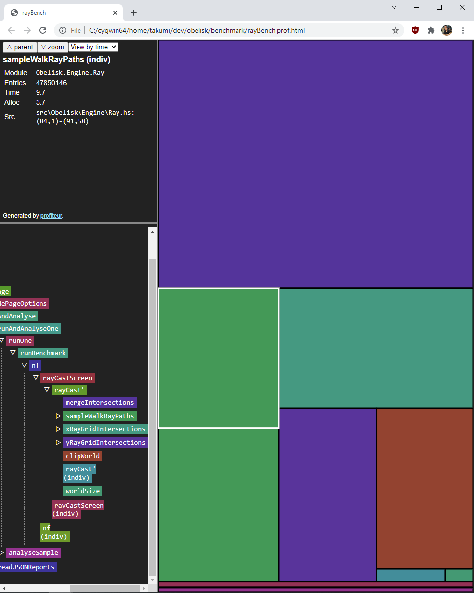
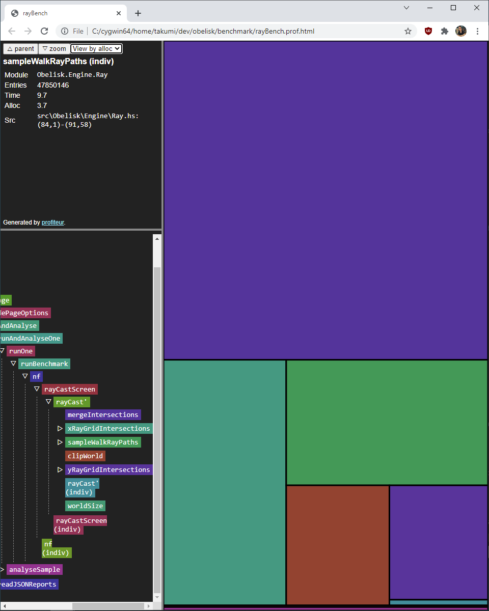

# Inspecting rayCastScreen for performance related details

## Overview

So far here is some initial benchmarking results of rayCastScreen on my home computer.

Things to note:

This was on an AMD Ryzen 7 3700x and rayCastScreen is single threaded. We still don't know if doing it in parallel for rays will be reasonable. Ideally we'll improve single threaded performance incase we ever target a lower spec machine.

Some of these numbers are done on a Intel(R) Core(TM) i5-6600 CPU @ 3.30GHz.
```
cabal build rayBench --enable-profiling

ghc-options:
    -O2
    -fprof-auto
    -prof
    "-with-rtsopts=-N -p -s -h -i0.1"

--RYZEN
benchmarking rayCasting/rayCastScreen/r640 w64
time                 7.502 ms   (7.467 ms .. 7.545 ms)
                     1.000 R²   (1.000 R² .. 1.000 R²)
mean                 7.566 ms   (7.551 ms .. 7.585 ms)
std dev              47.10 μs   (35.86 μs .. 64.84s)μ

benchmarking rayCasting/rayCastScreen/r320 w64
time                 3.773 ms   (3.759 ms .. 3.790 ms)
                     1.000 R²   (1.000 R² .. 1.000 R²)
mean                 3.768 ms   (3.759 ms .. 3.777 ms)
std dev              27.14 μs   (21.32 μs .. 35.37s)μ

benchmarking rayCasting/rayCastScreen/r240 w64
time                 2.862 ms   (2.847 ms .. 2.881 ms)
                     1.000 R²   (0.999 R² .. 1.000 R²)
mean                 2.849 ms   (2.841 ms .. 2.861 ms)
std dev              32.18 μs   (26.22 μs .. 41.57s)μ
```

## Inspection of Prof using Profiteur

Some overviews using the prof and [profiteur](https://github.com/jaspervdj/profiteur).





- So far we can tell that mergeIntersection takes up half our time and allocates more than half the allocations.

- Clipworld takes up a chunk of time which could potentially be optimized away if we bound ray travel to the last grid intersection. That represents around 9% of time and 6% of allocs.

- Normalizing the ray could be lifted to ray generation time. This is 7.5% of time totalled across both x and y rayGridIntersections. 2% of allocs.

- Map access itself is only 5% of the runtime 3% of allocs!

## TODO

We need to look at strictness analysis to make sure we aren't building uneccesarily huge thunks.

Figure out what is causing these allocations in the core output.

Do these cheap optimizations on clipworld/normalizing.

Figure out if Kmett's [Linear library](https://hackage.haskell.org/package/linear-1.21.5/docs/Linear-V2.html) is optimizing as expected.

Now that we have a reference raygrid intersection implementation and a debug graphic dsl we could take a stab at DDA again.

Tips from [GHC User Guide](https://mpickering.github.io/ghc-docs/build-html/users_guide/sooner.html) that we could try:

Use stricness anotations
Use unboxed types
Inline Pragma

## Cheap Micro Optimizations

### Removing Clipworld and bounding grid traversal

So we can just bound the traversal to within the world grid instead of infinitely. We use Data.Sequence from `containers` to avoid rebuilding the step sequence and take a bounded amount in logn time.

Before:
```haskell
baseSteps = [0.0 ..]
```

--INTEL
```
time                 9.361 ms   (8.688 ms .. 10.08 ms)
                     0.978 R²   (0.971 R² .. 0.989 R²)
mean                 8.659 ms   (8.341 ms .. 9.600 ms)
std dev              1.421 ms   (618.3 μs .. 2.846 ms)
variance introduced by outliers: 77% (severely inflated)

benchmarking rayCasting/rayCastScreen/r320 w64
time                 4.501 ms   (4.165 ms .. 4.912 ms)
                     0.972 R²   (0.958 R² .. 0.990 R²)
mean                 4.484 ms   (4.386 ms .. 4.619 ms)
std dev              372.0 μs   (282.2 μs .. 515.9 μs)
variance introduced by outliers: 54% (severely inflated)

benchmarking rayCasting/rayCastScreen/r240 w64
time                 3.379 ms   (3.267 ms .. 3.510 ms)
                     0.986 R²   (0.965 R² .. 0.996 R²)
mean                 3.359 ms   (3.288 ms .. 3.478 ms)
std dev              285.8 μs   (169.9 μs .. 503.8 μs)
variance introduced by outliers: 57% (severely inflated)
```

Via profiteur:

```
clipWorld
Time	6.6
Alloc	6.7

rayCast'
Time	97.7
Alloc	99

```

After:

```haskell
baseStepsSeq :: Int -> Sq.Seq Float
baseStepsSeq worldSize = Sq.fromList [0 .. (fromIntegral worldSize)]

baseStepsBounded :: Int -> Sq.Seq Float -> Float -> Float ->  Sq.Seq Float
baseStepsBounded worldSize bss axisPosition axisRay = Sq.take upperBound bss
    where
        upperBound = if axisRay > 0
                     then floor $ fromIntegral worldSize - axisPosition
                     else floor axisPosition
```

--INTEL
```
benchmarking rayCasting/rayCastScreen/r640 w64
time                 12.73 ms   (12.65 ms .. 12.81 ms)
                     1.000 R²   (1.000 R² .. 1.000 R²)
mean                 12.96 ms   (12.89 ms .. 13.05 ms)
std dev              213.8 μs   (169.3 μs .. 263.2 μs)

benchmarking rayCasting/rayCastScreen/r320 w64
time                 6.466 ms   (6.441 ms .. 6.488 ms)
                     1.000 R²   (1.000 R² .. 1.000 R²)
mean                 6.510 ms   (6.490 ms .. 6.543 ms)
std dev              75.29 μs   (46.11 μs .. 117.3 μs)

benchmarking rayCasting/rayCastScreen/r240 w64
time                 4.843 ms   (4.814 ms .. 4.875 ms)
                     1.000 R²   (1.000 R² .. 1.000 R²)
mean                 4.853 ms   (4.835 ms .. 4.876 ms)
std dev              60.81 μs   (42.27 μs .. 104.5 μs)

```

Yikes introduced a clear regression of 50% slow down (huge). Lets just not use Data.Sequence for now.

```
baseStepsSeq :: Int -> Sq.Seq Float
baseStepsSeq worldSize = Sq.fromList [0 .. (fromIntegral worldSize)]

baseStepsBounded :: Int -> Sq.Seq Float -> Float -> Float ->  Sq.Seq Float
baseStepsBounded worldSize bss axisPosition axisRay = Sq.take upperBound bss
    where
        upperBound = if axisRay > 0
                     then floor $ fromIntegral worldSize - axisPosition
                     else floor axisPosition
```

```haskell
baseSteps :: [Float]
baseSteps = [0.0 ..]

upperBound :: Int -> Float -> Float -> Int
upperBound worldSize axisPosition axisRay = if axisRay > 0
                                            then floor $ fromIntegral worldSize - axisPosition
                                            else floor axisPosition

baseStepsBounded :: Int -> Float -> Float -> [Float]
baseStepsBounded worldSize axisPosition axisRay = take (upperBound worldSize axisPosition axisRay) baseSteps
```

--INTEL
```
time                 8.294 ms   (8.242 ms .. 8.341 ms)
                     1.000 R²   (1.000 R² .. 1.000 R²)
mean                 8.400 ms   (8.366 ms .. 8.441 ms)
std dev              112.4 μs   (93.85 μs .. 139.0 μs)

benchmarking rayCasting/rayCastScreen/r320 w64
time                 4.208 ms   (4.177 ms .. 4.240 ms)
                     0.999 R²   (0.999 R² .. 1.000 R²)
mean                 4.192 ms   (4.178 ms .. 4.215 ms)
std dev              58.64 μs   (44.34 μs .. 82.98 μs)

benchmarking rayCasting/rayCastScreen/r240 w64
time                 3.133 ms   (3.122 ms .. 3.145 ms)
                     1.000 R²   (1.000 R² .. 1.000 R²)
mean                 3.136 ms   (3.128 ms .. 3.145 ms)
std dev              29.79 μs   (23.48 μs .. 40.80 μs)
```

Prof file diff

Before:
```
COST CENTRE           MODULE             SRC                                         %time %alloc

mergeIntersections    Obelisk.Engine.Ray src\Obelisk\Engine\Ray.hs:(77,1)-(81,31)     44.9   56.0
xRayGridIntersections Obelisk.Engine.Ray src\Obelisk\Engine\Ray.hs:(37,1)-(41,71)      9.7   15.0
sampleWalkRayPaths    Obelisk.Engine.Ray src\Obelisk\Engine\Ray.hs:(84,1)-(91,58)      9.7    3.7
clipWorld             Obelisk.Engine.Ray src\Obelisk\Engine\Ray.hs:(103,1)-(104,64)    8.9    6.7
normalize             Linear.Metric      src\Linear\Metric.hs:(107,1)-(108,23)         7.4    2.3
yRayGridIntersections Obelisk.Engine.Ray src\Obelisk\Engine\Ray.hs:(45,1)-(49,71)      5.2    4.9
epsilonBump           Obelisk.Engine.Ray src\Obelisk\Engine\Ray.hs:(70,1)-(74,64)      4.9    6.3
accessMap             Obelisk.State      src\Obelisk\State.hs:31:1-81                  3.4    0.0
accessMapV            Obelisk.State      src\Obelisk\State.hs:28:1-39                  2.3    3.6
rayCastScreen         Obelisk.Engine.Ray src\Obelisk\Engine\Ray.hs:133:1-105           1.0    0.3
```

After:
```
COST CENTRE           MODULE             SRC                                         %time %alloc

mergeIntersections    Obelisk.Engine.Ray src\Obelisk\Engine\Ray.hs:(88,1)-(92,31)    44.9   57.5
xRayGridIntersections Obelisk.Engine.Ray src\Obelisk\Engine\Ray.hs:(48,1)-(52,65)    11.7   14.4
sampleWalkRayPaths    Obelisk.Engine.Ray src\Obelisk\Engine\Ray.hs:(95,1)-(102,58)   10.2    3.6
epsilonBump           Obelisk.Engine.Ray src\Obelisk\Engine\Ray.hs:(81,1)-(85,64)     8.4    6.1
normalize             Linear.Metric      src\Linear\Metric.hs:(107,1)-(108,23)        5.4    2.2
baseStepsBounded      Obelisk.Engine.Ray src\Obelisk\Engine\Ray.hs:45:1-108           4.6    6.2
accessMap             Obelisk.State      src\Obelisk\State.hs:31:1-81                 4.3    0.0
yRayGridIntersections Obelisk.Engine.Ray src\Obelisk\Engine\Ray.hs:(56,1)-(60,65)     3.9    4.7
accessMapV            Obelisk.State      src\Obelisk\State.hs:28:1-39                 3.7    3.5
```

### Lifting Normalize
Great now we can move onto lifting normalize.

Diff
```
 xRayGridIntersections :: V2 Float -> V2 Float -> [Float] -> [V2 Float]
-xRayGridIntersections p r bss = (p +) . (*^ nr) <$> stepScales
+xRayGridIntersections p nr bss = (p +) . (*^ nr) <$> stepScales
     where
-        nr = normalize r
         firstStep = abs $ deltaFirst (p^._x) (nr ^._x)
         stepScales = [(firstStep + x) / abs (nr ^._x) | x <- bss] --TODO unbound this once everything is kosher so it can scale to any worldsize
 
-
+--NOTE: These rays should be normalized
 yRayGridIntersections :: V2 Float -> V2 Float -> [Float] -> [V2 Float]
-yRayGridIntersections p r bss = (p +) . (*^ nr) <$> stepScales
+yRayGridIntersections p nr bss = (p +) . (*^ nr) <$> stepScales
     where
-        nr = normalize r
         firstStep = abs $ deltaFirst (p^._y) (nr ^._y)
         stepScales = [(firstStep + y) / abs (nr ^._y) | y <- bss] --TODO unbound this once everythign is kosher so it can scale to any worldsize

 rayHeads :: CInt -> PVars -> [V2 Float]
-rayHeads screenWidth player = [direction player + (camera_plane player ^* x) | x <- cameraPlaneSweep screenWidth] :: [V2 Float]
+rayHeads screenWidth player = [normalize (direction player + (camera_plane player ^* x)) | x <- cameraPlaneSweep screenWidth] :: [V2 Float]
```

After:
--INTEL
```
time                 7.760 ms   (7.715 ms .. 7.823 ms)
                     0.999 R²   (0.999 R² .. 1.000 R²)
mean                 7.850 ms   (7.810 ms .. 7.931 ms)
std dev              156.1 μs   (98.23 μs .. 266.1 μs)

benchmarking rayCasting/rayCastScreen/r320 w64
time                 3.913 ms   (3.884 ms .. 3.944 ms)
                     1.000 R²   (0.999 R² .. 1.000 R²)
mean                 3.926 ms   (3.905 ms .. 3.983 ms)
std dev              102.8 μs   (43.45 μs .. 210.8 μs)
variance introduced by outliers: 10% (moderately inflated)

benchmarking rayCasting/rayCastScreen/r240 w64
time                 2.936 ms   (2.924 ms .. 2.946 ms)
                     1.000 R²   (1.000 R² .. 1.000 R²)
mean                 2.940 ms   (2.932 ms .. 2.947 ms)
std dev              26.10 μs   (21.21 μs .. 35.20 μs)
```

```
COST CENTRE           MODULE             SRC                                        %time %alloc

mergeIntersections    Obelisk.Engine.Ray src\Obelisk\Engine\Ray.hs:(86,1)-(90,31)    51.8   59.3
xRayGridIntersections Obelisk.Engine.Ray src\Obelisk\Engine\Ray.hs:(48,1)-(51,65)    11.4   14.5
epsilonBump           Obelisk.Engine.Ray src\Obelisk\Engine\Ray.hs:(79,1)-(83,64)     9.0    6.3
sampleWalkRayPaths    Obelisk.Engine.Ray src\Obelisk\Engine\Ray.hs:(93,1)-(100,58)    8.6    3.7
accessMap             Obelisk.State      src\Obelisk\State.hs:31:1-81                 4.6    0.0
baseStepsBounded      Obelisk.Engine.Ray src\Obelisk\Engine\Ray.hs:43:1-108           4.3    6.4
yRayGridIntersections Obelisk.Engine.Ray src\Obelisk\Engine\Ray.hs:(55,1)-(58,65)     4.1    4.4
accessMapV            Obelisk.State      src\Obelisk\State.hs:28:1-39                 3.4    3.6
```

### Dropping the square root

Linear provides a quadrance of difference.

```haskell
mergeIntersections :: V2 Float -> [V2 Float] -> [V2 Float] -> [V2 Float]
mergeIntersections playerpos (x:xs) (y:ys) = if qd playerpos x < qd playerpos y
                                             then x : mergeIntersections playerpos xs (y:ys)
                                             else y : mergeIntersections playerpos (x:xs) ys
```

--INTEL
```
benchmarking rayCasting/rayCastScreen/r640 w64
time                 4.132 ms   (4.092 ms .. 4.168 ms)
                     0.999 R²   (0.999 R² .. 1.000 R²)
mean                 4.169 ms   (4.147 ms .. 4.212 ms)
std dev              88.51 μs   (58.25 μs .. 156.3 μs)

benchmarking rayCasting/rayCastScreen/r320 w64
time                 2.087 ms   (2.077 ms .. 2.098 ms)
                     1.000 R²   (1.000 R² .. 1.000 R²)
mean                 2.083 ms   (2.075 ms .. 2.090 ms)
std dev              25.35 μs   (21.42 μs .. 30.94 μs)

benchmarking rayCasting/rayCastScreen/r240 w64
time                 1.540 ms   (1.530 ms .. 1.554 ms)
                     0.999 R²   (0.999 R² .. 1.000 R²)
mean                 1.558 ms   (1.550 ms .. 1.570 ms)
std dev              34.43 μs   (25.35 μs .. 46.95 μs)
variance introduced by outliers: 11% (moderately inflated)
```

```
COST CENTRE           MODULE             SRC                                        %time %alloc

xRayGridIntersections Obelisk.Engine.Ray src\Obelisk\Engine\Ray.hs:(48,1)-(51,65)    21.1   30.4
sampleWalkRayPaths    Obelisk.Engine.Ray src\Obelisk\Engine\Ray.hs:(93,1)-(100,58)   19.5    7.8
mergeIntersections    Obelisk.Engine.Ray src\Obelisk\Engine\Ray.hs:(86,1)-(90,31)    19.1   15.1
epsilonBump           Obelisk.Engine.Ray src\Obelisk\Engine\Ray.hs:(79,1)-(83,64)    14.1   13.2
baseStepsBounded      Obelisk.Engine.Ray src\Obelisk\Engine\Ray.hs:43:1-108           6.6   13.3
accessMapV            Obelisk.State      src\Obelisk\State.hs:28:1-39                 6.6    7.5
yRayGridIntersections Obelisk.Engine.Ray src\Obelisk\Engine\Ray.hs:(55,1)-(58,65)     5.7    9.3
accessMap             Obelisk.State      src\Obelisk\State.hs:31:1-81                 3.9    0.0
rayCastScreen         Obelisk.Engine.Ray src\Obelisk\Engine\Ray.hs:142:1-105          1.0    1.3
```

### Inline Pragma on epsilonBump

Before
--INTEL
```
benchmarking rayCasting/rayCastScreen/r640 w64
time                 4.243 ms   (4.208 ms .. 4.273 ms)
                     1.000 R²   (0.999 R² .. 1.000 R²)
mean                 4.286 ms   (4.275 ms .. 4.297 ms)
std dev              36.19 μs   (28.85 μs .. 46.43 μs)

benchmarking rayCasting/rayCastScreen/r320 w64
time                 2.145 ms   (2.136 ms .. 2.153 ms)
                     1.000 R²   (1.000 R² .. 1.000 R²)
mean                 2.147 ms   (2.139 ms .. 2.158 ms)
std dev              31.67 μs   (23.52 μs .. 47.57 μs)

benchmarking rayCasting/rayCastScreen/r240 w64
time                 1.639 ms   (1.613 ms .. 1.682 ms)
                     0.997 R²   (0.995 R² .. 0.999 R²)
mean                 1.627 ms   (1.616 ms .. 1.646 ms)
std dev              49.35 μs   (32.95 μs .. 72.14 μs)
variance introduced by outliers: 17% (moderately inflated)
```

After
--INTEL
```
benchmarking rayCasting/rayCastScreen/r640 w64
time                 3.824 ms   (3.809 ms .. 3.839 ms)
                     1.000 R²   (1.000 R² .. 1.000 R²)
mean                 3.844 ms   (3.831 ms .. 3.856 ms)
std dev              41.23 μs   (34.19 μs .. 52.23 μs)

benchmarking rayCasting/rayCastScreen/r320 w64
time                 1.923 ms   (1.916 ms .. 1.930 ms)
                     1.000 R²   (1.000 R² .. 1.000 R²)
mean                 1.931 ms   (1.924 ms .. 1.937 ms)
std dev              22.26 μs   (17.90 μs .. 27.88 μs)

benchmarking rayCasting/rayCastScreen/r240 w64
time                 1.444 ms   (1.438 ms .. 1.449 ms)
                     1.000 R²   (1.000 R² .. 1.000 R²)
mean                 1.448 ms   (1.444 ms .. 1.455 ms)
std dev              19.01 μs   (12.60 μs .. 33.17 μs)
```

### Inline Pragma on deltaFirst

--INTEL
```
benchmarking rayCasting/rayCastScreen/r640 w64
time                 3.728 ms   (3.698 ms .. 3.752 ms)
                     1.000 R²   (0.999 R² .. 1.000 R²)
mean                 3.759 ms   (3.748 ms .. 3.783 ms)
std dev              48.47 μs   (32.79 μs .. 82.89 μs)

benchmarking rayCasting/rayCastScreen/r320 w64
time                 1.889 ms   (1.882 ms .. 1.897 ms)
                     1.000 R²   (1.000 R² .. 1.000 R²)
mean                 1.884 ms   (1.879 ms .. 1.890 ms)
std dev              17.61 μs   (14.81 μs .. 21.55 μs)

benchmarking rayCasting/rayCastScreen/r240 w64
time                 1.426 ms   (1.407 ms .. 1.446 ms)
                     0.999 R²   (0.999 R² .. 1.000 R²)
mean                 1.419 ms   (1.413 ms .. 1.428 ms)
std dev              24.67 μs   (17.89 μs .. 36.40 μs)
```

This change might be negligible.

### Inline Pragma on accessMapV and accessMap

--INTEL
```
benchmarking rayCasting/rayCastScreen/r640 w64
time                 3.300 ms   (3.283 ms .. 3.316 ms)
                     1.000 R²   (0.999 R² .. 1.000 R²)
mean                 3.357 ms   (3.340 ms .. 3.378 ms)
std dev              62.55 μs   (49.52 μs .. 79.44 μs)

benchmarking rayCasting/rayCastScreen/r320 w64
time                 1.673 ms   (1.664 ms .. 1.682 ms)
                     1.000 R²   (1.000 R² .. 1.000 R²)
mean                 1.670 ms   (1.664 ms .. 1.677 ms)
std dev              22.10 μs   (17.63 μs .. 29.79 μs)

benchmarking rayCasting/rayCastScreen/r240 w64
time                 1.276 ms   (1.263 ms .. 1.290 ms)
                     0.999 R²   (0.999 R² .. 1.000 R²)
mean                 1.261 ms   (1.255 ms .. 1.268 ms)
std dev              23.06 μs   (18.57 μs .. 28.97 μs)
```

### Checking the regression of the Inline pragmas

Lets remove these 4 inline pragmas to get a rough idea of their total effect.

No inlines:
--INTEL
```
benchmarking rayCasting/rayCastScreen/r640 w64
time                 4.168 ms   (4.137 ms .. 4.198 ms)
                     0.999 R²   (0.999 R² .. 1.000 R²)
mean                 4.224 ms   (4.203 ms .. 4.249 ms)
std dev              72.12 μs   (59.94 μs .. 92.59 μs)

benchmarking rayCasting/rayCastScreen/r320 w64
time                 2.114 ms   (2.106 ms .. 2.122 ms)
                     1.000 R²   (1.000 R² .. 1.000 R²)
mean                 2.112 ms   (2.103 ms .. 2.121 ms)
std dev              30.92 μs   (23.69 μs .. 42.48 μs)

benchmarking rayCasting/rayCastScreen/r240 w64
time                 1.576 ms   (1.568 ms .. 1.582 ms)
                     1.000 R²   (0.999 R² .. 1.000 R²)
mean                 1.590 ms   (1.579 ms .. 1.631 ms)
std dev              62.88 μs   (15.57 μs .. 130.5 μs)
variance introduced by outliers: 26% (moderately inflated)
```

Inlined
```
benchmarking rayCasting/rayCastScreen/r640 w64
time                 3.300 ms   (3.276 ms .. 3.328 ms)
                     0.999 R²   (0.998 R² .. 1.000 R²)
mean                 3.328 ms   (3.311 ms .. 3.353 ms)
std dev              67.75 μs   (47.53 μs .. 104.2 μs)

benchmarking rayCasting/rayCastScreen/r320 w64
time                 1.665 ms   (1.656 ms .. 1.673 ms)
                     1.000 R²   (1.000 R² .. 1.000 R²)
mean                 1.672 ms   (1.665 ms .. 1.683 ms)
std dev              29.14 μs   (18.00 μs .. 53.23 μs)

benchmarking rayCasting/rayCastScreen/r240 w64
time                 1.339 ms   (1.285 ms .. 1.376 ms)
                     0.995 R²   (0.993 R² .. 0.997 R²)
mean                 1.267 ms   (1.254 ms .. 1.285 ms)
std dev              50.56 μs   (35.01 μs .. 66.94 μs)
variance introduced by outliers: 28% (moderately inflated)
```

So yes, we did achieve a 20% speedup from inlining those 4 small functions that were still in the hotloop.